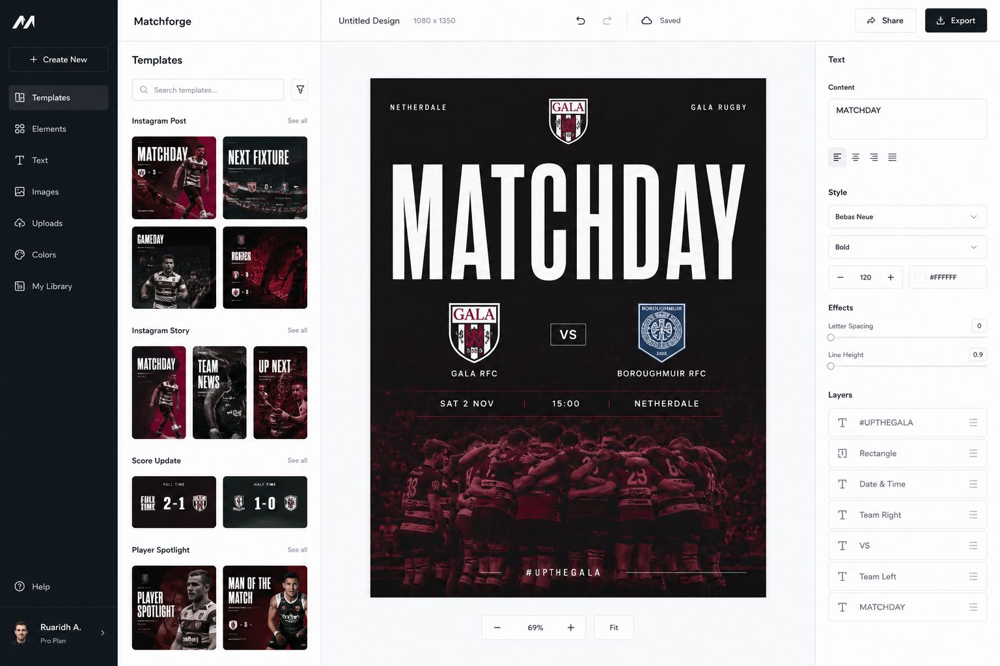

# Matchforge MVP

A runnable prototype of a modular sports matchday graphics editor and live match dashboard.



## Included
- Sleek desktop editor shell
- Live rugby match clock and scoring controls
- Moment graphics for tries, conversions, penalties, cards, half-time and full-time
- Match event timeline
- Scene queue
- Brand accent customisation
- Browser-side PNG export

## Run locally

```bash
npm install
npm run dev
```

Open `http://localhost:3000` in Chrome or Edge.

## Production check

```bash
npm run lint
npm run build
npm start
```

## Recommended production stack
- Next.js App Router
- React Konva for the full layer-based editor
- Zustand for local editor state
- Supabase for Auth, Postgres, Storage and Row Level Security
- Vercel for deployment

## Current limitations
This is an interactive front-end MVP. Data is stored in memory and resets on refresh. The graphic is currently composed from DOM layers; the roadmap replaces this with a serialized canvas document model before multi-user production use.

See `AGENTS.md` before giving the repository to Codex. It contains the architecture rules and implementation order.

## Windows installation notes

Use Node.js 20.9 or newer. For the most reliable Windows setup, keep the project outside a OneDrive-synchronised folder, for example `C:\Dev\matchforge-mvp`.

You can run `setup.cmd`, or install manually:

```bat
npm config set registry https://registry.npmjs.org/
npm install
npm run dev
```

If an earlier installation failed, close VS Code and any Node processes, delete `node_modules`, then run the commands again.
